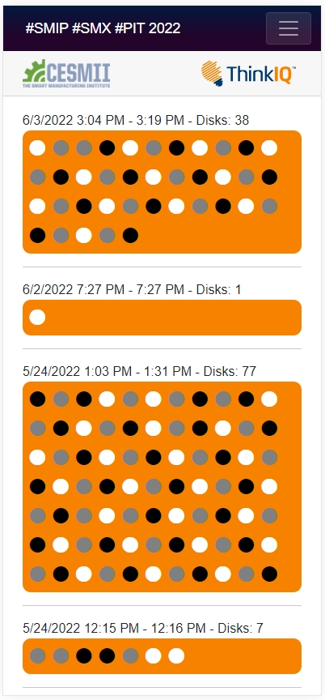

# SMIP-SMX-2022

This is a demo repository with 2 applications that render a report in real-time based on SMIP data that was used at the Smart Manufacturing Experience (SMX) Conference in 2022 at the Conference Center in Pittsburgh, PA.

Note-worthy C# goodies include:

- data/SmipEntry.cs includes logic to get JWT access tokens using a SMIP authenticator (Authenticator.cs)
- data/SmipService.cs contains GraphQL web requests used to get SMIP data
- data/SmipModel.cs contains short classes to de-serialize GraphQL responses
- Pages/FetchRuns.razor is the page that renders the report and also incldues logic for retrieving, cleansing, and aligning the data to fit the UI.

## .Net Core Blazor Server App

Blazor [WebApp](https://smipsmxpit2022webapp.azurewebsites.net/): 

## .Net Core MAUI Blazor App

Below is a screenshot of the same appliation but ported to utilize the new .NET Multi-platform App UI (.NET MAUI) framework - shown here running as a Windows Desktop App. This would allow running the demo, but without the need of hosting a WebApp.

