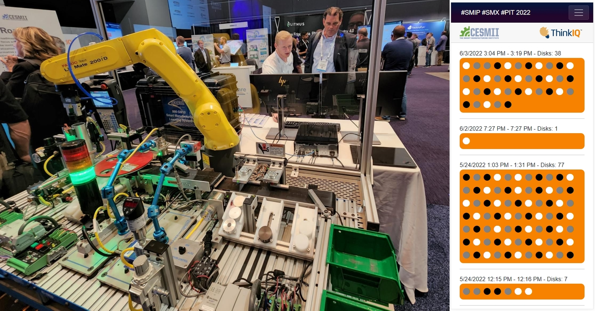
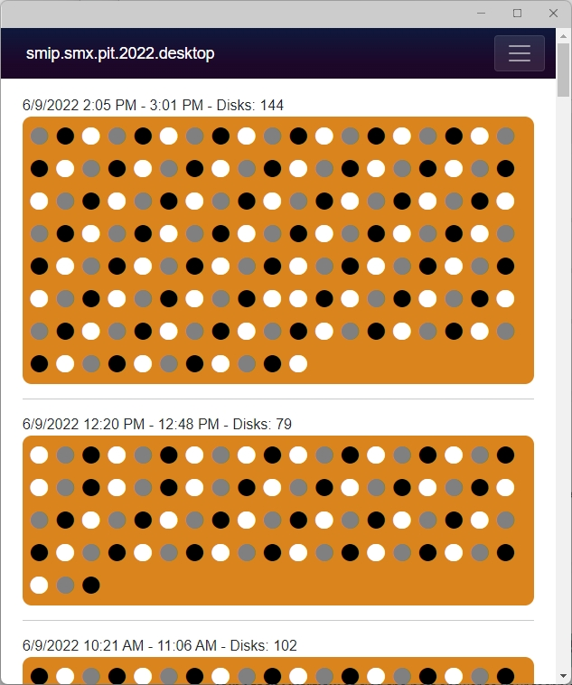

# SMIP-SMX-2022

This is a repository with two demo applications that render a report in real-time based on SMIP data. These demos were created for the Smart Manufacturing Experience (SMX) Conference in 2022 at the David L. Lawrence Conference Center in Pittsburgh, PA. These demos were a collaboration between ThinkIQ, CESMII, and Amatrol.

Note-worthy C# items include:

- data/SmipEntry.cs includes logic to get JWT access tokens using a SMIP authenticator (Authenticator.cs)
- data/SmipService.cs contains GraphQL web requests used to get SMIP data
- data/SmipModel.cs contains short classes to de-serialize GraphQL responses
- Pages/FetchRuns.razor is the page that renders the report and also includes logic for retrieving, cleansing, and aligning the data to fit the UI.

## .Net Core Blazor Server App

Amatrol Robot at convention floor with Blazor [WebApp](https://smipsmxpit2022webapp.azurewebsites.net/): 

## .Net Core MAUI Blazor App

Below is a screenshot of the same application but ported to utilize the new .NET Multi-platform App UI (.NET MAUI) framework - shown here running as a Windows Desktop App. This would allow running the demo without needing to host a WebApp.

